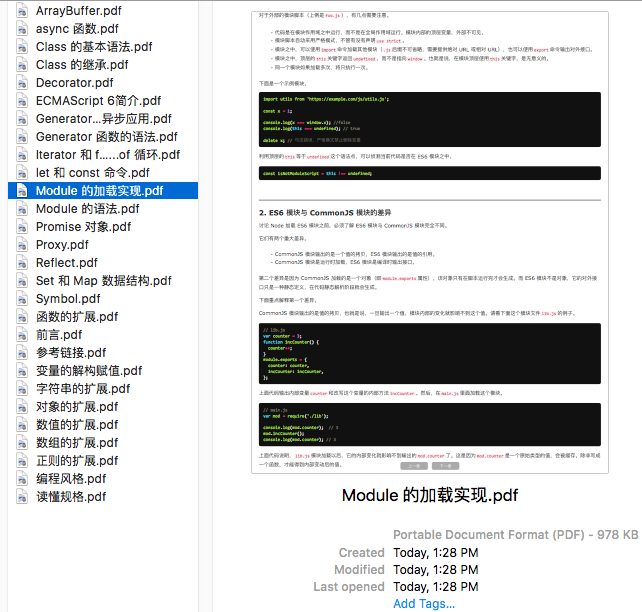
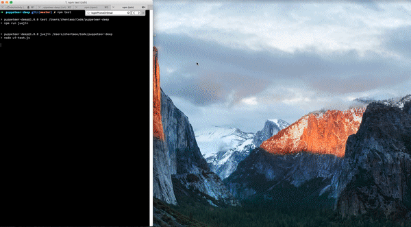

## Puppeteer-Deep (Node: v8.4.0)

#### API
https://github.com/GoogleChrome/puppeteer/blob/master/docs/api.md#puppeteerlaunchoptions

#### Introduce
Puppeteer是一个node包，他提供了用来控制Chrome的高级API，有点类似于PhantomJS。不同于Phantom，Puppeteer是Chrome官方团队进行维护的，前景更好。在这个repo中，主要先介绍Puppeteer，具体的应用场景不断发掘

#### Puppeteer Key Feature
1. 用网页生成的PDF文件
2. 爬取 SPA应用 并生成预渲染内容（即“SSR”）
3. 从网站抓取内容
4. 自动化表单提交、UI测试、键盘输入等。
5. 创建一个最新的自动化测试环境。直接在
6. 使用最新的JavaScript和最新版本Chrome。
7. 捕获站点的时间线跟踪，以帮助诊断性能问题。

## Scene

1. Crawler（爬取阮老师的es6, 具体流程可以看代码，下面提几个关键点）
`npm run es6`: 执行之后，会在es6-pdf下生成阮老师的es6文章的pdf版本

2. UI-Test UI自动化测试--拿掘金开刀，把sf的文章自动搬运到jj，这里为了方便录制使用headless false模式，下面是一张完整效果的动图，20M显示比较慢，请耐心等下

3. Performance (性能分析, 待完成....)
