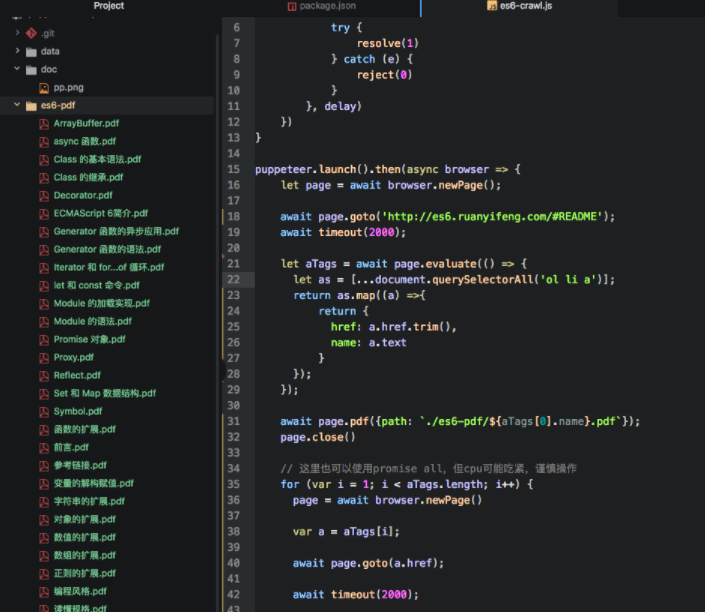
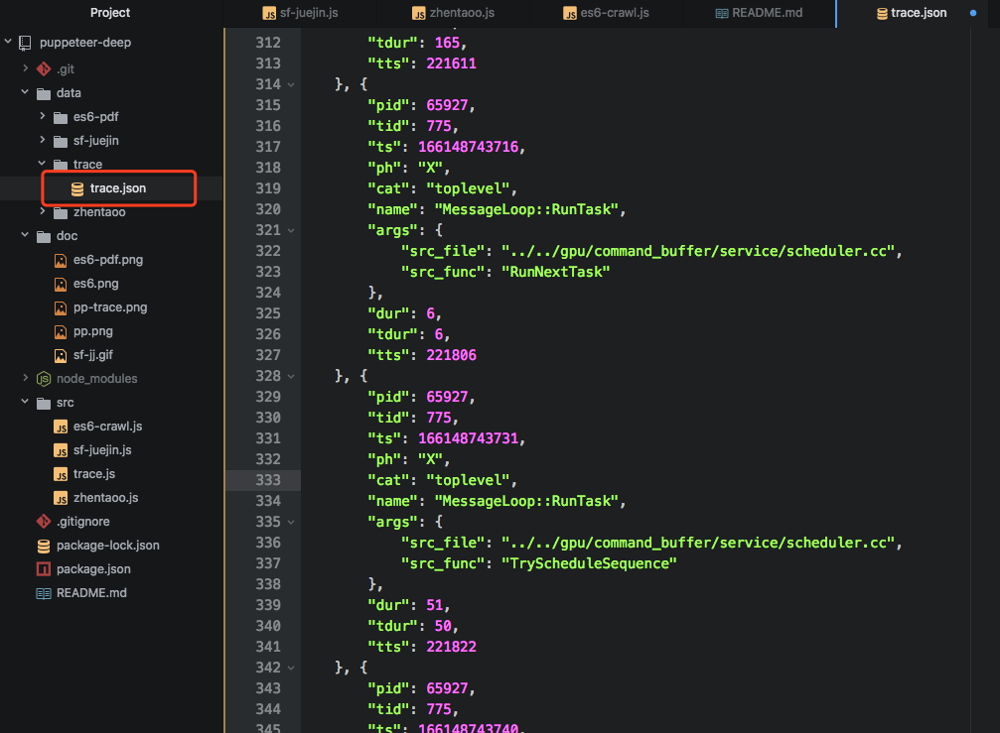
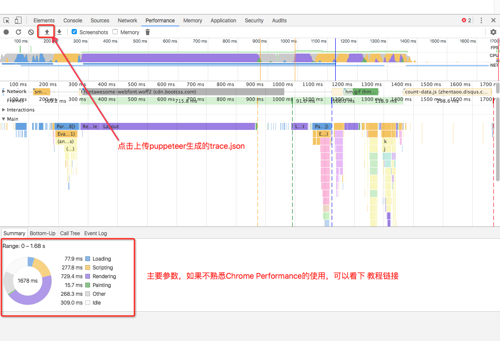

## 首先介绍Puppeteer
- Puppeteer是一个node库，他提供了一组用来操纵Chrome的API，理论上使用它可以做任何Chrome可以做的事
- 有点类似于PhantomJS，但Puppeteer由Chrome官方团队进行维护，前景更好
- Puppeteer的应用场景会非常多，就爬虫领域来说，远比一般的爬虫工具功能更丰富，性能分析、自动化测试也不在话下
- [Puppeteer官方文档请猛戳这里](https://github.com/GoogleChrome/puppeteer/blob/master/docs/api.md#puppeteerlaunchoptions)

## 提下Puppeteer的应用场景, 本项目会针对此做几个可用的DEMO，有些会放入博客进行详解
1. 高级爬虫（有别于传统爬虫.使用Puppeteer可以拿到渲染后的效果。而传统爬虫相当于只能拿到http response，对字符串进行解析）
2. UI自动化测试（使用Puppeteer可以模拟用户操作，模拟表单填写）
3. 页面性能分析 (使用chrome的timeline，也就是Puppeteer提供的trace API)
4. 访问 http://www.zhentaoo.com/2017/08/23/Pupputeer2/ , 有3篇更为细致的介绍

## 项目Repo && Usage
1. git clone https://github.com/zhentaoo/puppeteer-deep
2. npm install (puppeteer在win下100+M、mac下70+M，请耐心等候)

- npm run sf-juejin (推荐segmentfault的热门文章到掘金)
- npm run monitor (前端监控、报警)
- npm run es6 (爬取了阮一峰老师的《ES6标准入门》并打印PDF)
- npm run zhentaoo (打印 www.zhentaoo.com 首页的图片)
- npm run trace (生成 www.zhentaoo.com 的trace.json，并分析性能)

## 一、 UI自动化测试--自动推荐segmentfault的热门文章到掘金
#### 1. 废话不多说，先上动图/视频看效果
  GIF图片比较大，如果不能加载成功，也可以到微博看下录制的视频
  http://weibo.com/tv/v/FiHMz7dcq?fid=1034:dcc08a8eee118263f6071fb6fafcc9a9

  

#### 2. 开始介绍，第一步，爬取 segmentfault 前30篇热门文章
  - 跳转到https://segmentfault.com/news/frontend
  - 接着分析SF首页的Dom结构，爬取每篇文章的链接
  - 然后取出每篇文章最重要的 href，title 等信息
  - 具体代码如下：
  ```js
      await page.goto('https://segmentfault.com/news/frontend')

      var SfFeArticleList = await page.evaluate(() => {
          var list = [...document.querySelectorAll('.news__list .news__item-title a')]
          return list.map(el => {
              return {href: el.href.trim(), title: el.innerText}
          })
      })

      await page.screenshot({path: './sf-juejin/sf.png', type: 'png'});
  ```

#### 3. 登录掘金 (这里我事先注册了个测试账号,大家可以替换成自己的)
- 跳转到掘金，模拟点击登录按钮
- 接着，会弹出一个的登录dialog，模拟输入用户名密码
- 模拟点击登录，稍等....嗯...掘金应该把cookie写好了....
- 代码如下：
```js
      await page.goto('https://juejin.im')

      var login = await page.$('.login')
      await login.click()

      var loginPhoneOrEmail = await page.$('[name=loginPhoneOrEmail]')
      await loginPhoneOrEmail.click()
      await page.type('18516697699@163.com', {delay: 20})

      var password = await page.$('[placeholder=请输入密码]')
      await password.click()
      await page.type('123456', {delay: 20})

      var authLogin = await page.$('.panel .btn')
      await authLogin.click()
```
#### 4.推荐文章（使用第一步从SF爬取的文章信息）
- 模拟点击推荐文章 按钮 “＋”
- 这时从SF拿到的文章信息就派上用场了，随机取出一篇: Math.floor(Math.random() * 30)
- 模拟填写推荐表单，点击发布
- 嗯，有时会提示该文章已被分享，那就换一篇吧，再执行一次。
- 代码如下
```js
      var seed = Math.floor(Math.random() * 30)
      var theArtile = SfFeArticleList[seed]

      var add = await page.$('.main-nav .ion-android-add')
      await add.click()

      var shareUrl = await page.$('.entry-form-input .url-input')
      await shareUrl.click()
      await page.type(theArtile.href, {delay: 20})

      await page.press('Tab')
      await page.type(theArtile.title, {delay: 20})

      await page.press('Tab')
      await page.type(theArtile.title, {delay: 20})

      await page.evaluate(() => {
          let li = [...document.querySelectorAll('.category-list-box .category-list .item')]
          li.forEach(el => {
              if (el.innerText == '前端')
                  el.click()
          })
      })

      var submitBtn = await page.$('.submit-btn')
      await submitBtn.click()
```

## 二、 前端监控系统 http://zhentaoo.com/2017/10/14/Puppeteer3

#### 代码 https://github.com/zhentaoo/hawk-eye

#### 1. 为什么要有前端监控系统?
 > 目前市面上以及各大公司流行的监控系统，都是API层的监控，包括调用量、数据、响应时长.....
 > 似乎只要接口没问题，整个系统就是稳定运行的，一切皆大欢喜
 > 但事实并非如此，CDN、DNS、Webview等等这些条件，都可能导致前端渲染失败、白屏
 > 离用户最近的一层--前端，却迟迟没有被加入监控列表，无形中流失多少用户.....

#### 2. Node Express Server
  - 如果还不会用express，请看我的博客 http://www.zhentaoo.com/2016/05/13/ExpressJS/
  - 使用 `express monitor` 命令，生成express项目模版
  - 安装并启动mongodb，推荐 robomongo 可视化工具
  - 提供两个接口，1当Puppeteer发现网页渲染有异常则调用,2获取系统监控状态

#### 3. 定时脚本
  - 设置定是脚本，每隔5分钟，访问 www.zhentaoo.com，抓取关键信息，并生成截图
  - 如果信息获取失败，则将截图保存至err目录，并记入数据库中
  ```js
  function monitor() {
  puppeteer.launch().then(async browser => {
      let page = await browser.newPage();

      await page.goto('http://www.zhentaoo.com/');
      await timeout(2000);

      let aTags = await page.evaluate(() => {
        let as = [...document.querySelectorAll('ol li a')];
        return as.map((a) =>{
            return {
              href: a.href.trim(),
              name: a.text
            }
        });
      });

      await page.screenshot({path: './data/zhentaoo/zhentaoo.png', type: 'png'});
      browser.close();
    });
  }

  monitor();
  setInterval(monitor, 1000 * 60 * 5);
  ```

#### 4. 进阶：与Chrome插件集成
  > 如果单纯的监控系统，每每需要点击，然后去看监控的情况，想必也有些麻烦
  > 那么为何不做个Chrome插件，显示监控状态呢？
  > 好吧，可以看我的另一个repo，https://github.com/zhentaoo/bitcoin-price，学习如何写一个chrome插件
  > 然后监控系统提供API给Chrome插件使用

## 三、高级爬虫--爬取《ES6标准入门》并打印成PDF

#### 1. 运行Puppeteer，使用launch
  ```js
    puppeteer.launch().then(async browser => {
      ......
      what you want
      ......
    })
  ```

#### 2. 跳转至 [阮一峰老师的ES6博客](http://es6.ruanyifeng.com/#README)，使用goto
  ```js
    let page = await browser.newPage();
    await page.goto('http://es6.ruanyifeng.com/#README');
  ```

#### 3. 分析博客左侧导航栏的dom结构，并拿到所有链接的href、title信息
  ```js
    let as = [...document.querySelectorAll('ol li a')];
    return as.map((a) =>{
        return {
          href: a.href.trim(),
          name: a.text
        }
    });
  ```

#### 4. 使用Puppeteer打印当前页面的PDF，使用pdf
  ```js
    await page.pdf({path: `./es6-pdf/${aTags[0].name}.pdf`});
  ```

#### 5. 最终结果，将20多页博客打印成PDF
  


## 四、性能分析--Puppeteer Trace API

#### 1. 简单介绍 Trace API
  > Trace API其实很简单，主要是使用Chrome Performance，生成当前页面的 性能追踪 文件，
  然后将该文件上传给Chrome，就可以利用Chrome的开发者工具分析火焰图、各种数据参数

#### 2. API: 使用 tracing start，stop生成trace.json
  ```js
  await page.tracing.start({path: './data/trace/trace.json'});
  await page.goto('http://www.zhentaoo.com');
  await page.tracing.stop();
  ```
  <!--  -->

#### 3. 将trace.json上传给chrome，如下图
  

#### 4. Chrome Performance/Timeline 使用教程
关于Chrome Performance／Timeline的使用又是一个大篇幅，这里提供一个教程
  - [Chrome 开发者工具](https://developers.google.com/web/tools/chrome-devtools/?hl=zh-cn)
  - [如何查看性能](https://developers.google.com/web/tools/chrome-devtools/?hl=zh-cn)
  - [分析运行时性能](https://developers.google.com/web/tools/chrome-devtools/evaluate-performance/timeline-tool?hl=zh-cn)
  - [诊断强制的同步布局](https://developers.google.com/web/tools/chrome-devtools/rendering-tools/forced-synchronous-layouts?hl=zh-cn)


## 结语
  1. 为了效果展示，这里使用的headless: false模式，实际使用时可以同时开n个page，模拟操作，大家可以尝试改改，也可以给我提PR
  2. 目前已经带领大家，使用Puppeteer完成爬虫 和 UI自动化测试，接下来可能会出第三篇，应该会是关于前端性能分析
  3. 其实Puppeteer的应用场景远不止这些，大家也可以使用它在各自的领域大放异彩！！！
  4. 希望掘金小编不会打我....
